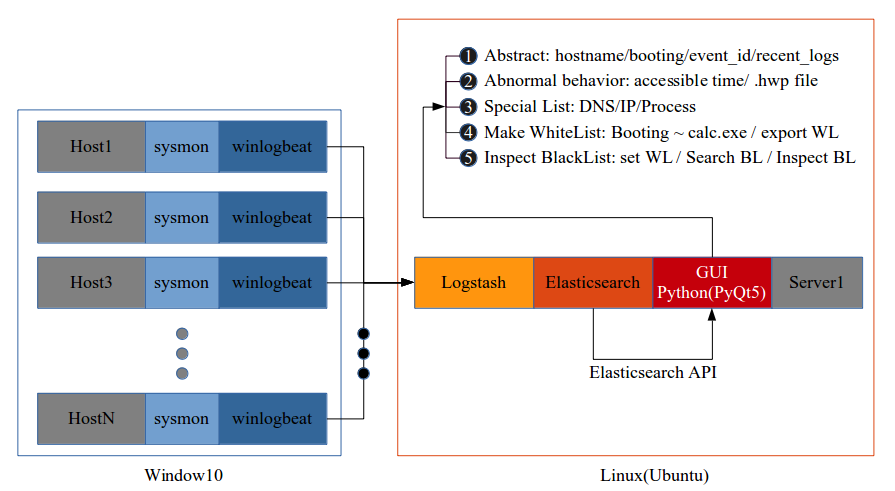

# Sysmon-EL-Python(PyQt5)
Sysmon logs in the window environment are received from a computer in another environment through winlogbeat through Logstash, and then repositioned in Elasticsearch and displayed in PyQt.

### Architecture



### Layout


## [HOST] Install Sysmon & Winlogbeat ( Winodw Env )

### Sysmon

#### Download Sysmon 
* https://docs.microsoft.com/en-us/sysinternals/downloads/sysmon

#### Download sysmonconfig-export.xml
* https://github.com/SwiftOnSecurity/sysmon-config/blob/master/sysmonconfig-export.xml

#### Run Sysmon
```
PS> .\sysmon.exe -i [sysmonconfig-export.xml]
PS> .\sysmon.exe -c [update_sysmonconfig-export.xml]
```

### Winlogbeat

#### Setting and Download winlogbeat
- Download:  [https://www.elastic.co/kr/downloads/beats/winlogbeat](https://www.elastic.co/kr/downloads/beats/winlogbeat)

- Setting winlogbeat.yml for sending Sysmon logs 
```
winlogbeat.event_logs:
    - name: Microsoft-Windows-Sysmon/Operational

output.logstash:
    # The Logstash hosts
    hosts: ["Ubuntu_IP:5000"]
    index: winlogbeat
```    

#### Apply Setting winlogbeat 
```
PS> .\winlogbeat.exe -c .\winlogbeat.yml
```
#### Run winglobeat
```
PS> .\install-service-winlogbeat.ps1
PS> start-service winlogbeat
```

## [SERVER] Install Elasticsearch & Logstash by Docker ( Linux Env )

### Download Docker images
```
$ git clone https://github.com/deviantony/docker-elk.git
$ sudo docker-compose build
```

### Elasticsearch 

* Disable some functions of X-pack <br/>

```
$ vim ./elasticsearch/config/elasticsearch.yml

cluster.name: "docker-cluster" 
network.host: 0.0.0.0 
discovery.type: single-node
```

### Logstash

```
$ vim ./logstash/config/logstash.yml

http.host: "0.0.0.0"
xpack.monitoring.elasticsearch.hosts: [ "http://elasticsearch:9200" ]
```

```
$ vim ./logstash/pipeline/logstash.conf

input {
    beats{
        port => 5000
    }    
}

output {
    elasticsearch {
        hosts => "elasticsearch:9200"
        user => "usernmaet"
        password => "password"
        index => "%{[@metadata][beat]}-%{+YYYY.MM.dd}"
        document_type => "%{[@metadata][type]}"
    }
}
```
### Run Docker-Container
```
# sudo docker-compose up 
```

> Basic port
5000: Logstash TCP input
9200: Elasticsearch HTTP
9300: Elasticsearch TCP transport
5601: Kibana


### Stop Docker-Container
```
# sudo docker-compose down
```


## [SERVER] PyQt5 by Python3.7 ( Linux Env )

### Function

#### Abstract

#### Abnormal behavior

#### Special List

#### Make WhiteList

#### Search BlackList


</br>

<details>
<summary>Timeline</summary>


<div markdown="1">

## 2020.08.18 
 local -> git connected
## 2020.08.19
 whitelist 함수 정의 및 구현
## 2020.08.20
* Upload Reference </br>
* server에서 client의 값이 들어오지 않을때</br> 
 1. network 상태가 이전 상태와 같은지 확인
 2. network 상태가 같다면 ip의 변동이 있는지 확인
 3. network 상태가 바뀌었다면 winlogbeat.yml의 ip를 확인
* Upload ui file
## 2020.08.21
* Update Whitelist 이외의 layout 구현 완료
* Error 찾는중 1번 실행은 잘 되지만 clear이후 2번실행은 값이 변하지 않는 것이 발견됌
## 2020.08.22
* Abnormal Tab idea구상
* Abnormal Tab layout 구현 완료
## 2020.08.24
* Abnormal .hwp file open 잡기 가능
## 2020.08.25
* Sysmon - EL - PyQt5 구현 완료
 

</div>
</details>

<details>
<summary>Reference(CLICK)</summary>
 

<div markdown="1">

* docker Sysmon-ELK: 
 https://github.com/choisungwook/malware/tree/master/01%20blue%20team/sysmon/01%20elk%EC%84%A4%EC%B9%98%2B%EC%97%B0%EB%8F%99
* Docker, ELK: https://judo0179.tistory.com/60
* Docker, ELK: https://github.com/deviantony/docker-elk
* winlogbeat: https://cyberwardog.blogspot.com/2017/02/setting-up-pentesting-i-mean-threat_87.html
* ubuntu18 고정 IP 설정: https://www.manualfactory.net/10455

</div>
</details>
